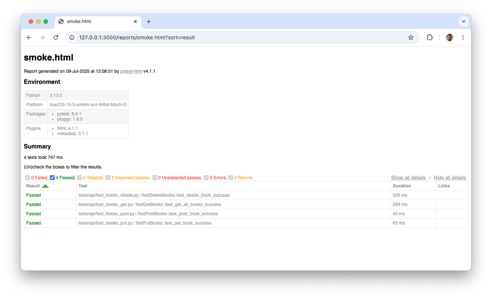
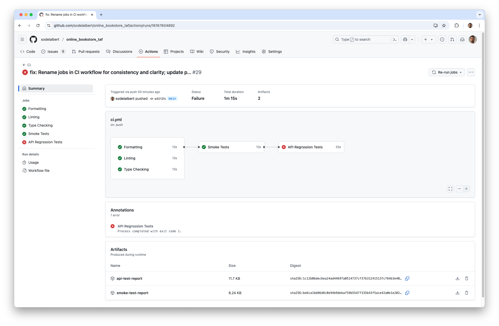
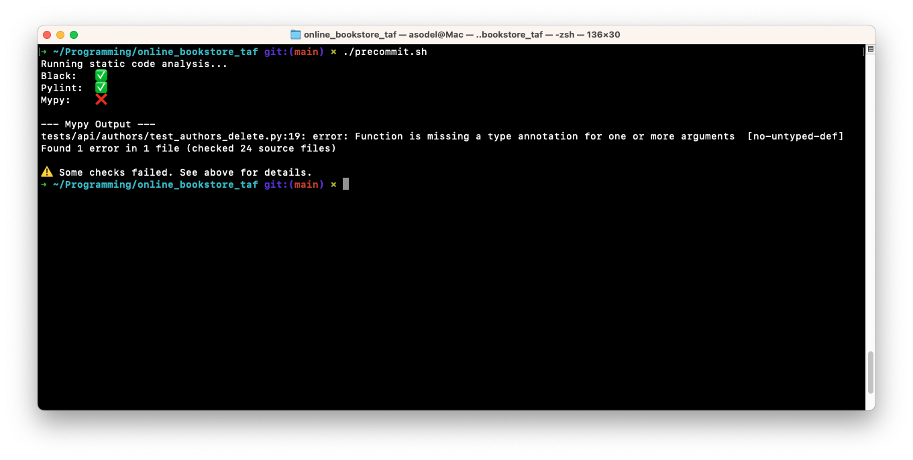

# Online Bookstore - Test Automation Framework

This is a sample test automation project developed in **Python**, primarily focused on API testing. The framework integrates **CI/CD pipelines** using GitHub Actions for automated testing and deployment. It features **static code analysis** tools such as `black`, `pylint`, and `mypy` to ensure code quality and consistency.

Environment variables are managed securely using a `.env` file (not included in the repository for security reasons), allowing flexible configuration of test URLs and credentials. A `precommit.sh` script is provided to automate code formatting and linting before commits, helping maintain code standards across the project.

Thanks to its modular project structure, the framework can be easily extended to support UI and end-to-end (e2e) tests in addition to API testing.

[](https://github.com/sodelalbert/online_bookstore_taf/actions/workflows/ci.yml) _Note: CI jobs may currently fail due to defects detected during automated testing._

## 🗂️ Project Structure

The project follows a modular structure to promote clarity and scalability. Source code is organized under the `src/` directory, which contains dedicated folders for API clients, shared data, and response models. Test cases are grouped by type within the `tests/` directory, supporting API, UI, and end-to-end (e2e) testing. Supporting assets such as documentation, reports, and sample files are placed in their respective top-level folders. Configuration files, scripts for code quality enforcement, and environment variable management are included at the root level to streamline development and testing workflows.

```text
online_bookstore_taf/
├── .github/                # Github Actions configuration
├── docs/                   # Project documentation
├── reports/                # Test reports and artifacts
├── samples/                # Sample files
├── src/                    # Source code for API clients, data, and models
│   ├── api/                # HTTP client configuration
│   ├── data/               # Common data management folder for tests
│   └── models/             # Response models for API tests
├── tests/                  # Test cases organized by type (api/, ui/, e2e/)
│   ├── api/
│   ├── ui/
│   └── e2e/
├── precommit.sh            # Script for local code formatting and linting
├── pyproject.toml          # Project configuration and dependency list
├── .env                    # Project variables configuration
└── README.md               # Project documentation
```

## ⚙️ Installation & Configuration

This project uses [`uv`](https://github.com/astral-sh/uv) for Python package management instead of `pip`. `uv` is a modern, high-performance installer that speeds up dependency installation, ensures deterministic environments through dependency locking, and simplifies setup with built-in virtual environment management. All dependencies are defined in `pyproject.toml`, and you can install them or run tests directly using `uv`, making development and CI/CD workflows faster and more reliable.

To be able to use this project, first install `uv` on your system:

```bash
curl -Ls https://astral.sh/uv/install.sh | sh
```

The project uses a `.env` file in the **root directory** to manage environment-specific variables, such as the base URL. To set up your environment, copy `.env.sample` to `.env` and update the variables as needed. This approach allows for easy extension and customization without exposing sensitive data, as `.env` is excluded from version control via .gitignore.

```bash
cp samples/.env.sample .env
```

‼️ After copying make sure that you configured missing variavbles i.e `BOOKS_API_BASE_URL = "https://testapifwk.com/"` in `.env` located in project root ‼️

## 🚀 Running Test Cases

This framework streamlines setup by automatically handling Python and dependency installation:

- 🐍 **Automatic Python Installation:**  
   If Python is not detected, the `uv` tool will prompt you to install the required version, ensuring compatibility and a smooth onboarding experience.

- 📦 **Automatic Dependency Installation:**  
   All dependencies listed in `pyproject.toml` are installed automatically when you run `uv`. No need to manually manage packages—just run your tests and let `uv` handle the rest!

This automation reduces setup errors and ensures every contributor works in a consistent environment.

To install correct python version, dependencies and execute all test cases execute following command:

```bash
uv run pytest
```

### Test Markers

This framework uses **pytest markers** to categorize and selectively run tests. The main markers available are:

```toml
markers = [
    "smoke: Smoke tests for quick validation",
    "api: API integration tests",
    "ui: User interface tests",
    "e2e: End-to-end tests",
]
```

You can run tests with a specific marker using the `-m` option. For example, to run only API tests:

```bash
uv run pytest -m api
```

To run smoke tests across all types:

```bash
uv run pytest -m smoke
```

## 📊 Reporting

Test reporting is seamlessly integrated into the framework. **Pytest** is preconfigured to generate and store test reports automatically in the `reports/` directory after each run. This ensures that test results, including detailed logs and summaries, are consistently available for review and sharing. The reporting setup supports both human-readable HTML reports and machine-readable formats, making it easy to analyze results locally or in CI/CD pipelines.



## 🚦 CI/CD Pipelines

The project leverages **GitHub Actions** for robust CI/CD automation. The pipeline is designed to ensure code quality and reliability at every stage:

- **Static Code Analysis:**  
   Each push or pull request triggers jobs that run `black`, `pylint`, and `mypy` to enforce code formatting, linting, and type checking. This helps catch issues early and maintain high code standards.

- **Automated Testing:**  
   The workflow executes both smoke tests and full API regression suites using `pytest`. Test runs are categorized by markers, allowing for fast feedback on critical functionality and comprehensive validation of API endpoints.

- **Secure Secrets Management:**  
   Sensitive information such as API keys and credentials are managed using GitHub Secrets. These secrets are injected into the workflow environment at runtime, ensuring they are never exposed in logs or version control.

- **Test Results and Reporting:**  
   After each test run, detailed reports are generated and uploaded as workflow artifacts. This makes it easy for contributors and reviewers to access test results directly from the GitHub Actions interface, supporting transparent and efficient collaboration.

The CI/CD setup ensures that every code change is automatically validated, securely tested, and clearly reported, streamlining the development and deployment process.



## 🤝 Code Standard & Contribution

The project enforces a consistent **code style** using `black` for formatting, `pylint` for linting, and `mypy` for static type checking. All code should use clear type annotations and concise, meaningful comments to improve readability and maintainability.

The included `precommit.sh` script allows you to automatically format, lint, and type-check your code locally before committing. This ensures code quality and lets you catch issues early—without needing to push changes to the repository or trigger CI/CD pipelines.


